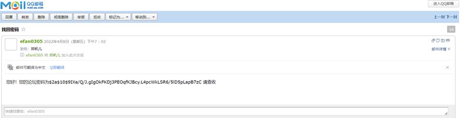

# game-forum

> 程序前台使用的是现在较为成熟的Vue.js框架以及由饿了么设计的Element UI桌面端组件库。论坛后台使用的是Spring Boot框架去编写论坛业务逻辑代码。持久层框架采用MyBatis-Plus去操作数据库。

在线体验：

​	前台系统：[http://119.91.145.137:8083/](http://119.91.145.137:8083/)

​	后台管理系统：[http://119.91.145.137:8084/](http://119.91.145.137:8084/)

## 本课题将完成以下目标：

（1）建立游戏评分机制以及非法评论敏感词过滤机制，在净化交流环境的同时，提升论坛的交流氛围，为网上冲浪的人们营造良好的交流环境。

（2）本系统能够实现论坛系统的基本功能。主要有论坛平台用户注册、登录、注销以及个人信息编辑，以及论坛最基本的核心功能——帖子管理模块（发布帖子、编辑帖子、评论、审核），帖子分类管理，游戏话题管理，公告管理，系统管理，留言反馈，采用 Apache ECharts 开源可视化图表库去实现论坛信息的可视化。 

（3）系统操作简单，界面简洁美观，页面统一友好，有直观的操作提示。

（4）在条件允许的情况下，本课题将考虑拓展的功能点：点赞、收藏帖子；后台登录需要验证码的辅助；论坛支持模糊搜索功能（搜索相关的游戏以及帖子）；对游戏、帖子进行点赞、收藏；以及论坛支持数据导出功能并引入了wangEditor 组件 —— 由Typescript 开发的 Web 富文本编辑器，通过自定义配置支持多媒体文件上传，轻量、简洁、易用以及最重要的一点就是它开源免费，编辑帖子更加便利。

## 系统功能性需求分析

### 本课题通过划分模块来实现论坛系统的多种功能。本系统具有以下功能。
1. 用户管理

用户登录，用户注册，用户修改个人信息，找回密码，管理员修改用户信息，管理员删除用户信息，管理员修改用户权限。

2. 帖子管理

浏览帖子（支持查看综合推荐、最新帖子、置顶帖子及精华帖子），发表帖子，编辑帖子，搜索帖子（模糊搜索、按类别及标签搜索帖子），管理员审核帖子，管理员删除帖子。

3. 游戏管理

浏览游戏，获取游戏资讯，搜索游戏，游戏评分排行，管理员增加游戏信息，管理修改游戏信息，管理删除游戏信息。

4. 评论管理

发表评论，敏感性过滤处理，查看帖子评论，审核评论信息，管理员删除评论信息。

5. 类别管理

管理员实现对帖子分类、帖子标签及游戏类别信息的增删改查。

6. 点赞

成功登录的用户能够给对应帖子点赞，或者给喜欢的游戏点赞，增加热度。

7. 收藏

成功登录的用户能够收藏喜欢的帖子，或者收藏喜欢的游戏，增加热度。该功能实现的是已注册的用户可以在个人中心页面中管理自己收藏的帖子以及游戏。

8. 留言功能

发表留言，管理员查看留言，管理员删除留言。

9. 上传功能

更换头像，富文本编辑器上传图片及多媒体视频。

10.	公告管理

浏览公告，管理员发布公告，管理员删除公告，管理员修改公告。

11.	友链管理

浏览友链，管理员管理论坛合作友链的增加、删除、修改。

## 系统功能测试

### 1.1 登录

 

用户访问网址http://localhost:8080/，进入论坛网站。首先，点击“登录”按钮，用户进入登录页面。如图6-1所示，输入用户名称、密码及选择登录角色权限，信息正确即可登录成功。如图6-2所示，测试登录功能成功，用户能够正常登录系统，进入论坛首页。

图 6-1 用户登录

图 6-2 首页界面

 

### 1.2 注册

 

首先，点击“注册”按钮，用户进入注册页面。如图6-3所示，输入用户名称、密码、确认密码、邮箱、性别及生日，信息正确即可注册成功（系统默认注册用户权限为普通用户）。测试注册功能成功，用户能够使用注册的账户正常登录系统，进入论坛首页。

图 6-3 注册页面

如图6-4所示，用户注册过程，要保证用户名唯一，出现重复界面错误信息会提示“用户名已存在”，无法注册成为论坛用户。

图 6-4 用户名唯一验证

如图6-5所示，用户注册过程，要保证邮箱唯一，否则界面会提示“邮箱已被绑定”，无法注册成为论坛用户。

图 6-5 邮箱唯一验证

 

### 1.3 发帖

 

首先，点击标题栏“创作”按钮，登录的用户可以进入编辑帖子的页面。其次，如图6-6所示，输入帖子标题、帖子简介及发帖内容，内容支持图片、视频及动态表情，帖子编辑完毕后，用户可以为帖子增加分类或者标签，点击“发布”按钮即可发布帖子。与此同时，页面跳转到首页。测试发帖功能成功，如图6-7所示，用户在个人主页中管理自己编写的帖子。

图 6-6 发帖界面

图 6-7 个人主页-发帖管理

 

### 1.4 浏览帖子

 

本课题提供了六种方式去筛选出帖子列表，方便用户查找和浏览帖子。首页对帖子类别进行分类别显示，主要包括综合推荐帖子、最新帖子、置顶帖子及精华帖子。如图6-8所示，本课题还支持搜索框模糊搜索帖子。浏览帖子模块功能测试成功。

图 6-8 搜索帖子

如图6-9所示，在筛选后的结果列表中，用户点击帖子卡片即可进入帖子详情页面浏览帖子。

图 6-9 浏览帖子

 

### 1.5 浏览游戏

 

首先，首页游戏推荐按照游戏的评分排名显示评分最高的游戏排行。其次，游戏列表页面支持用户按游戏类别筛选游戏。如图6-10所示，最后，本课题还支持搜索框模糊搜索游戏列表，方便用户查找和浏览游戏。浏览游戏模块功能测试成功。

图 6-10 搜索游戏

如图6-11所示，在筛选后的结果列表中，用户点击游戏卡片即可进入游戏详情页面浏览游戏。

图 6-11 浏览游戏

 

### 1.6 游戏评分机制

 

如图6-12所示，用户进入游戏详情页面，点击评分组件，可以利用颜色数组对分数及情感倾向进行分级。如图6-13所示，评分成功即界面会显示评分分数及更新总得分。评分功能测试成功。

图 6-12 评分界面

图 6-13 评分成功

 

### 1.7 评论敏感词过滤

 

如图6-14所示，用户在评论区撰写评论及看法，撰写完成即点击“发表评论”按钮，评论区显示该条评论即评论成功。评论功能测试成功。

图 6-14 评论界面

如图6-15所示，如果评论的内容出现非法字符或违规内容，需要对其进行敏感词过滤处理，非法字符将会被替换成“***”。

图 6-15 敏感词过滤界面

 

### 1.8 找回密码

 

如图6-16所示，用户登录系统时忘记密码，可以点击“忘记密码? 点此取回”链接，输入正确的邮箱及用户名，点击提交即发送邮件到用户邮箱。如图6-17所示，通过邮箱找回密码功能测试成功。

图 6-16 找回密码界面

图 6-17 接收邮件

 

### 1.9 上传功能

 

如图5-20所示，用户可以在更换头像时上传自己本地图片，编辑帖子过程中上传图片及多媒体视频。如图6-22所示，wangEditor富文本编辑器显示图片及视频成功，上传功能测试成功。

图 6-20 上传图片

图 6-21 上传视频

图 6-22  wangEditor编辑器浏览界面

 

 

 

 

### 1.10  留言功能

 

如图6-18所示，用户点击标题栏的“留言”按钮，输入姓名、手机号及想要留言的内容，点击“提交”按钮即提示留言成功。如图6-19所示，管理员可以在后台管理收到的留言。发布留言功能测试成功。

图 6-18发布留言

 

图 6-19 后台管理留言